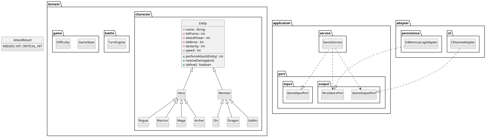

### 1. Visão geral da arquitetura(Ports&Adapters / Hexagonal)

```
┌──────────────┐        Ports (interfaces)       ┌──────────────┐
│  CLI Adapter │ ────▶  application.port.input   │   Game Core  │
│  (driver)    │ ◀───  application.port.output  ┌│   (domain &  │
└──────────────┘                                ││ application) │
                                                │└──────────────┘
┌──────────────┐        application.service      │
│ Persistência │ ◀───  application.port.output   │
│ (driven)     │                                │
└──────────────┘                                ▼
                                           External World
```

* **Domain** –lógica de jogo pura, sem dependências externas (`domain.*`
  *Entities, Value Objects, Enums, Services de domínio*).
* **Application** –“casos de uso” que orquestram o domínio (`application.*`).
* **Ports** –interfaces que a camada de aplicação **expõe** (input) ou **espera** (output).
* **Adapters** –implementações concretas dessas interfaces: CLI, REST, persistência, etc.

---

### 2. Estrutura de pacotes proposta

```
br.ufpa.TurnEnginebasedgame
├─ domain
│  ├─ character           (Entity, Hero, Monster + subclasses)
│  ├─ battle              (TurnEngine, AttackResult)
│  ├─ game                (GameState, Difficulty)
│  └─ log                 (BattleLog, BattleLogEntry)
├─ application
│  ├─ port
│  │  ├─ input            (GameInputPort, QueryInputPort)
│  │  └─ output           (GameOutputPort, PersistencePort)
│  └─ service             (GameService, TurnEngineService)
└─ adapter
   ├─ cli                 (CliGameAdapter)
   └─ persistence         (InMemoryLogAdapter, FileLogAdapter, etc.)
```

---

### 3. Modelo de domínio

```java
package br.ufpa.TurnEnginebasedgame.domain.character;

// Comentários em português descrevendo intenção de cada componente.
public abstract class Entity {
    protected final String name;
    protected int hitPoints;
    protected int attackPower;
    protected int defense;
    protected int dexterity;
    protected int speed;

    public Entity(String name, int hitPoints, int attackPower,
                  int defense, int dexterity, int speed) {
        this.name = name;
        this.hitPoints = hitPoints;
        this.attackPower = attackPower;
        this.defense = defense;
        this.dexterity = dexterity;
        this.speed = speed;
    }

    // Getters e Setters omitidos para brevidade.

    /** Método abstrato que cada subclasse implementa para descrever seu ataque. */
    public abstract int performAttack(Entity target);

    /** Retorna true se o jogador ainda possui vida. */
    public boolean isAlive() { return hitPoints > 0; }

    /** Aplica dano já calculado. */
    public void receiveDamage(int rawDamage) {
        int effective = Math.max(0, rawDamage - defense);
        hitPoints = Math.max(0, hitPoints - effective);
    }

    /** Fábrica estática para criar heróis ou monstros aleatórios. */
    public static Entity randomEntity(Random rnd, boolean hero) {
        return hero ? HeroFactory.randomHero(rnd)
                    : MonsterFactory.randomMonster(rnd);
    }
}
```

#### 3.1. Subclasses de **Hero**

```java
public class Warrior extends Hero {
    public Warrior(String name) {
        super(name,
              120,  // hitPoints
              25,   // attackPower
              15,   // defense
              10,   // dexterity
              12);  // speed
    }

    @Override
    // Warrior causa dano direto sem efeitos.
    public int performAttack(Entity target) { return attackPower; }
}

public class Mage extends Hero {
    public Mage(String name) {
        super(name, 80, 30, 5, 18, 14);
    }

    @Override
    public int performAttack(Entity target) {
        int spellDamage = attackPower + 10; // bônus mágico
        return spellDamage;
    }
}

public class Archer extends Hero { /* … */ }
public class Rogue  extends Hero { /* … */ }
```

#### 3.2. Subclasses de **Monster**

```java
public class Goblin extends Monster { /* … características fracas … */ }
public class Orc    extends Monster { /* … médias … */ }
public class Dragon extends Monster { /* … chefe forte … */ }

/** IA simples: atacar o herói com menor HP. */
@Override
public int decideTargetIndex(List<Hero> heroes) {
    return IntStream.range(0, heroes.size())
                    .filter(i -> heroes.get(i).isAlive())
                    .boxed()
                    .min(Comparator.comparingInt(i -> heroes.get(i).getHitPoints()))
                    .orElse(0);
}
```

---

### 4. Mecânica de batalha

```java
package br.ufpa.TurnEnginebasedgame.domain.battle;

public enum AttackResult {
    MISSED, HIT, CRITICAL_HIT
}

public final class TurnEngine {

    // Decide ordem baseada em speed.
    public List<Entity> sortedBySpeed(List<Entity> lineup) {
        return lineup.stream()
                     .sorted(Comparator.comparingInt(Entity::getSpeed).reversed())
                     .collect(Collectors.toList());
    }

    /**
     * Executa um TurnEngineo completo.
     * @return lista de BattleLogEntry para persistência.
     */
    public List<BattleLogEntry> playTurnEngine(List<Entity> heroes, List<Entity> monsters) {
        List<Entity> everyone = new ArrayList<>();
        everyone.addAll(heroes);
        everyone.addAll(monsters);

        List<BattleLogEntry> events = new ArrayList<>();

        for (Entity attacker : sortedBySpeed(everyone)) {
            if (!attacker.isAlive()) continue;
            Entity target = chooseTarget(attacker, heroes, monsters);
            AttackResult result = resolveAttack(attacker, target, events);
            events.add(new BattleLogEntry(attacker, target, result));
        }
        return events;
    }

    private AttackResult resolveAttack(Entity attacker, Entity target,
                                       List<BattleLogEntry> events) {
        double hitChance = attacker.getDexterity() /
                           (double)(attacker.getDexterity() + target.getDexterity());
        double roll = Math.random();
        if (roll > hitChance) return AttackResult.MISSED;

        boolean crit = roll < 0.1; // 10% crítico.
        int rawDmg = crit ? attacker.performAttack(target) * 2
                          : attacker.performAttack(target);
        target.receiveDamage(rawDmg);
        return crit ? AttackResult.CRITICAL_HIT : AttackResult.HIT;
    }
}
```

---

### 5. Estado do jogo e níveis de dificuldade

```java
public enum Difficulty {
    EASY(1.0), MEDIUM(1.25), HARD(1.5);

    public final double monsterMultiplier;
    Difficulty(double m) { this.monsterMultiplier = m; }
}

public class GameState {
    private final List<Hero> heroes;
    private final List<Monster> monsters;
    private final Difficulty difficulty;
    private int currentRound = 0;

    // getters…
}
```

---

### 6. Portas da aplicação

```java
package br.dev.joaobarbosa.application.ports.input;

import br.dev.joaobarbosa.domain.GameState;
import br.dev.joaobarbosa.logs.BattleLogEntry;
import java.util.List;

public interface GameInputPort {
    void startGame();

    void playTurn();

    void endGame();

    GameState getGameState();

    List<BattleLogEntry> getBattleLogs();

    List<BattleLogEntry> getLastTurnLogs();
}
```

---

### 7. Serviço de aplicação

```java
// Orquestra o domínio sem expor detalhes externos.
public class GameService implements GameInputPort {
    private final GameOutputPort output;
    private final PersistencePort persistence;
    private GameState state;
    private final TurnEngine TurnEngineEngine = new TurnEngine();

    public GameService(GameOutputPort output, PersistencePort persistence) {
        this.output = output;
        this.persistence = persistence;
    }

    @Override
    public void startGame(int heroCount, Difficulty diff) {
        this.state = GameFactory.newGame(heroCount, diff);
    }

    @Override
    public void playRound() {
        List<BattleLogEntry> events =
            TurnEngineEngine.playTurnEngine(state.getHeroes(), state.getMonsters());

        events.forEach(persistence::saveEntry);
        output.presentRoundResult(events, state);

        if (isGameOver()) output.presentGameOver(state);
    }

    @Override
    public void endGame() { /* libera recursos, salva estado final */ }

    private boolean isGameOver() {
        boolean heroesAlive   = state.getHeroes().stream().anyMatch(Entity::isAlive);
        boolean monstersAlive = state.getMonsters().stream().anyMatch(Entity::isAlive);
        return !(heroesAlive && monstersAlive);
    }
}
```

---

### 8. Adaptadores

#### 8.1. `CliGameAdapter`

```java
public class CliGameAdapter implements Runnable {

    private final GameService gameService;

    public CliGameAdapter(GameService gameService) {
        this.gameService = gameService;
    }

    @Override
    public void run() {
        Scanner scanner = new Scanner(System.in);
        System.out.println("=== Turn-Based Game ===");
        System.out.print("Escolha dificuldade (1=Easy, 2=Medium, 3=Hard): ");
        int diffChoice = scanner.nextInt();

        Difficulty difficulty = switch (diffChoice) {
            case 1 -> Difficulty.EASY;
            case 2 -> Difficulty.MEDIUM;
            default -> Difficulty.HARD;
        };

        gameService.startGame(3, difficulty);

        boolean playing = true;
        while (playing) {
            System.out.println("\n[1] Jogar rodada\n[2] Ver estado atual\n[3] Ver logs\n[0] Sair");
            int cmd = scanner.nextInt();

            switch (cmd) {
                case 1 -> {
                    gameService.playRound();
                    printLastRoundLogs();
                }
                case 2 -> printGameState();
                case 3 -> printAllLogs();
                case 0 -> {
                    gameService.endGame();
                    playing = false;
                }
                default -> System.out.println("Opção inválida.");
            }
        }
    }

    private void printLastRoundLogs() {
        System.out.println("--- Logs da Última Rodada ---");
        gameService.getLastRoundLogs()
                .forEach(log -> System.out.println(log.toHumanReadable()));
    }

    private void printAllLogs() {
        System.out.println("--- Histórico Completo ---");
        gameService.getBattleLogs()
                .forEach(log -> System.out.println(log.toHumanReadable()));
    }

    private void printGameState() {
        GameState state = gameService.getGameState();
        System.out.println("--- Estado Atual ---");
        state.getHeroes().forEach(hero -> System.out.println(hero.getName() + " HP: " + hero.getHitPoints()));
        state.getMonsters().forEach(monster -> System.out.println(monster.getName() + " HP: " + monster.getHitPoints()));
    }
}
```

#### 8.2. `InMemoryLogAdapter`

```java
public class InMemoryLogAdapter implements PersistencePort {
    private final List<BattleLogEntry> store = new ArrayList<>();
    public void saveEntry(BattleLogEntry e) { store.add(e); }
    public List<BattleLogEntry> loadAll() { return List.copyOf(store); }
}
```

---

### 9. Exceções customizadas

```java
// Usar sempre que um parâmetro inválido for detectado.
public class InvalidParameterException extends RuntimeException {
    public InvalidParameterException(String msg) { super(msg); }
}
```

---

### 10. Diagrama UML (PlantUML textual)


### 11. Classe BattleLogEntry

```java
package br.dev.joaobarbosa.logs;

import br.dev.joaobarbosa.domain.AttackResult;
import java.time.Instant;
import java.time.ZoneId;
import java.time.format.DateTimeFormatter;
import java.util.Locale;
import java.util.Objects;
import lombok.Getter;

/**
 * Representa **um único evento de combate**.
 *
 * <p>Campos registrados:
 *
 * <ul>
 *   <li>attackerName / targetName – nomes capturados no momento do ataque
 *   <li>roundNumber – rodada da batalha (começa em 1)
 *   <li>turnOrderIndex – posição do atacante na ordem daquele round (0‑based ou 1‑based, você
 *       escolhe; usamos 1‑based)
 *   <li>rawDamage – dano "bruto" retornado por performAttack()
 *   <li>effectiveDamage – dano após defesa aplicada
 *   <li>targetHpBefore / targetHpAfter – HP do alvo antes/depois do ataque
 *   <li>result – MISSED, HIT, CRITICAL_HIT
 *   <li>killingBlow – true se o ataque reduziu HP do alvo a 0
 *   <li>timestamp – instante em que o evento foi registrado
 * </ul>
 */
@Getter
public final class BattleLogEntry {

  private static final DateTimeFormatter TS_FMT =
      DateTimeFormatter.ofPattern("uuuu-MM-dd'T'HH:mm:ss'Z'", Locale.ROOT)
          .withZone(ZoneId.of("UTC"));

  private final String attackerName;
  private final String targetName;
  private final int roundNumber;
  private final int turnOrderIndex; // 1‑based dentro da rodada
  private final int rawDamage;
  private final int effectiveDamage;
  private final int targetHpBefore;
  private final int targetHpAfter;
  private final AttackResult result;
  private final boolean killingBlow;
  private final Instant timestamp;

  private BattleLogEntry(
      String attackerName,
      String targetName,
      int roundNumber,
      int turnOrderIndex,
      int rawDamage,
      int effectiveDamage,
      int targetHpBefore,
      int targetHpAfter,
      AttackResult result,
      boolean killingBlow,
      Instant timestamp) {
    this.attackerName = attackerName;
    this.targetName = targetName;
    this.roundNumber = roundNumber;
    this.turnOrderIndex = turnOrderIndex;
    this.rawDamage = rawDamage;
    this.effectiveDamage = effectiveDamage;
    this.targetHpBefore = targetHpBefore;
    this.targetHpAfter = targetHpAfter;
    this.result = Objects.requireNonNull(result, "result");
    this.killingBlow = killingBlow;
    this.timestamp = Objects.requireNonNull(timestamp, "timestamp");
  }

  public static BattleLogEntry of(
      String attacker,
      String target,
      int roundNumber,
      int turnOrderIndex,
      int rawDamage,
      int effectiveDamage,
      int targetHpBefore,
      int targetHpAfter,
      AttackResult result,
      Instant instant) {
    Instant timestamp = (instant != null) ? instant : Instant.now();

    boolean kill = (result != AttackResult.MISSED) && targetHpAfter <= 0 && targetHpBefore > 0;
    return new BattleLogEntry(
        attacker,
        target,
        roundNumber,
        turnOrderIndex,
        rawDamage,
        effectiveDamage,
        targetHpBefore,
        targetHpAfter,
        result,
        kill,
        timestamp);
  }

  public static BattleLogEntry of(
      String attacker,
      String target,
      int roundNumber,
      int turnOrderIndex,
      int rawDamage,
      int effectiveDamage,
      int targetHpBefore,
      int targetHpAfter,
      AttackResult result) {

    boolean kill = (result != AttackResult.MISSED) && targetHpAfter <= 0 && targetHpBefore > 0;
    return new BattleLogEntry(
        attacker,
        target,
        roundNumber,
        turnOrderIndex,
        rawDamage,
        effectiveDamage,
        targetHpBefore,
        targetHpAfter,
        result,
        kill,
        Instant.now());
  }

  public String toHumanReadable() {
    if (result == AttackResult.MISSED) {
      return String.format(
          Locale.ROOT,
          "R%d#%d %s errou %s (HP %d)",
          roundNumber,
          turnOrderIndex,
          attackerName,
          targetName,
          targetHpBefore);
    }
    String crit = (result == AttackResult.CRITICAL_HIT) ? " (CRÍTICO)" : "";
    String kill = killingBlow ? " [KILL]" : "";
    return String.format(
        Locale.ROOT,
        "%dº Turno [%d] - %s atingiu %s%s: -%d (HP %d → %d)%s",
        roundNumber,
        turnOrderIndex,
        attackerName,
        targetName,
        crit,
        effectiveDamage,
        targetHpBefore,
        targetHpAfter,
        kill);
  }

  public String toCsvRow() {
    return String.join(
        ",",
        TS_FMT.format(timestamp),
        escape(attackerName),
        escape(targetName),
        String.valueOf(roundNumber),
        String.valueOf(turnOrderIndex),
        result.name(),
        String.valueOf(rawDamage),
        String.valueOf(effectiveDamage),
        String.valueOf(targetHpBefore),
        String.valueOf(targetHpAfter),
        String.valueOf(killingBlow));
  }

  public static String csvHeader() {
    return "timestamp,attacker,target,round,turn,result,rawDamage,effectiveDamage,targetHpBefore,targetHpAfter,killingBlow";
  }

  private static String escape(String v) {
    if (v == null) return "";
    if (v.contains(",") || v.contains("\"")) {
      return '"' + v.replace("\"", "\"\"") + '"';
    }
    return v;
  }

  @Override
  public String toString() {
    return toHumanReadable();
  }
}
```